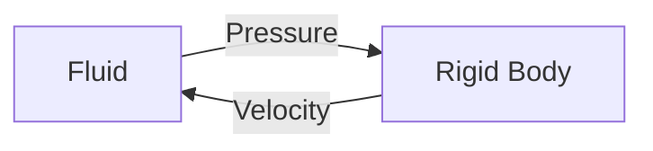

---
# try also 'default' to start simple
theme: seriph
# random image from a curated Unsplash collection by Anthony
# like them? see https://unsplash.com/collections/94734566/slidev
background: /bg.png
# some information about your slides (markdown enabled)
title: Report
info: |
  ## Slidev Starter Template
  Presentation slides for developers.

  Learn more at [Sli.dev](https://sli.dev)
# apply UnoCSS classes to the current slide
class: text-center
# https://sli.dev/features/drawing
drawings:
  persist: false
# slide transition: https://sli.dev/guide/animations.html#slide-transitions
transition: fade-out
# enable MDC Syntax: https://sli.dev/features/mdc
mdc: true
# duration of the presentation
duration: 35min
---

# Physics-Based Simulation

Rigid body, cloth and fluid.

Final presentation by *Li Beier* and *Li Kairui*.

<div class="abs-br m-6 text-xl">
  <a href="https://github.com/Tbl0x7D6/ACG-Project" target="_blank" class="slidev-icon-btn">
    <carbon:logo-github />
  </a>
</div>


<!--
大家好，我们小组做的是基于物理的流体，刚体，布料仿真。
-->

---
transition: fade
---

# Overview

A framework for fluid, rigid body and cloth

- Rigid: quaternion based rotational representation and dynamics
- Cloth: mass-spring model
- Fluid
  - Euler's view: grid based
  - Surface geometry: level set method, advection and reconstruction (Eikonal eqt. iteration)
  - Jacobi iteration & PCG solver
- Coupling
  - Impulse method between rigid body and cloth
  - Strong coupling between rigid body and fluid
- Rendering: mesh processing

<!--
刚体用的四元数
布料是弹簧质点模型
流体用的欧拉网格法，表面用的levelset表示，实现了强流固耦合
-->

---
transition: fade
---

# Rigid Body

Quaternion based rotational representation and dynamics

<v-click>

- $q$: orientation quaternion

- $\omega_c$: angular velocity in the body frame

- $\tau_{\text{world}}$: torque in the world frame

- $I$: inertia tensor in the body frame

</v-click>

<v-click>

  $$ \mathrm{d}q = \frac{1}{2} q \omega_c \cdot \mathrm{d}t $$

  $$ \mathrm{d}\omega_c = I^{-1} \mathrm{d}t \cdot (q^* \tau_{\text{world}} q - \omega_c \times I \omega_c) $$

</v-click>

<!--
这是更新刚体状态的动力学方程
-->

---
transition: fade
layout: two-cols-header
---

# Cloth

Mass-spring model

::left::


::right::

<br><br>

```python
for spring_offset in ti.static(_spring_offsets):
    j = i + spring_offset
    if 0 <= j[0] < num_particles_width and
       0 <= j[1] < num_particles_height:
        x_ij = x[i] - x[j]
        v_ij = v[i] - v[j]
        d = x_ij.normalized()
        rest_length = spring_offset.norm() * quad_size
        force += - k * d * (x_ij.norm() / rest_length - 1.0)
        force += - v_ij.dot(d) * d * dashpot_damping * quad_size
```

<!--
这是弹簧质点模型，每个质点受到周围质点弹簧的拉力和正比于速度的阻力
-->

---
transition: fade
---

# Rigid Body & Cloth Collision

Impulse method

- How to detect collision?

<v-click>

  - BVH (Bounding Volume Hierarchy)

    - Use stack to traverse the tree (`@taichi.func` does not support recursion)

    - Directly compute normal vector from triangle

</v-click>

<v-click>

  - SDF (Signed Distance Function)

    - Discussed later in fluid section

    - Approximate normal vector using central difference

</v-click>

<!--
我们实现了两种刚体布料碰撞检测，分别是BVH和刚体mesh的有符号距离函数
-->

---
transition: fade
---

# Rigid Body & Cloth Collision

Impulse method

```python {*|3-4|9|11-17}
@ti.kernel
def substep():
    bunny.substep(dt)
    cloth.substep(dt)

    bunny.torque[None] = ti.Vector([0.0, 0.0, 0.0])
    for i in ti.grouped(cloth.x):
        cloth.v[i] += gravity * dt
        collision, normal = bunny.collision(cloth.x[i])
        if collision:
            p = cloth.x[i]
            v_surface = bunny.velocity_at_point(p)
            v_rel = cloth.v[i] - v_surface
            delta_v = ti.max(-v_rel.dot(normal), 0) * normal
            cloth.v[i] += delta_v
            cloth.x[i] += normal * 1e-3
            bunny.torque[None] += (p - bunny.x[None]).cross(-delta_v * cloth.particle_mass / dt)
```

<!--
两者各自进行substep

然后进行碰撞检测

然后计算每个布料质点的冲量，作用回去
-->

---
transition: fade
---

# Rigid Body & Cloth Collision

Impulse method

- Use BVH to accelerate collision detection (high precision)

<br>
<div class="flex justify-center gap-10">
  <SlidevVideo autoplay width="35%">
    <source src="/cloth-bunny.mp4" type="video/mp4" />
  </SlidevVideo>
</div>

<!--
这是BVH的例子，优点是模拟精度高
-->

---
transition: fade
---

# Rigid Body & Cloth Collision

Impulse method

- Use SDF to accelerate collision detection (real-time)

<br>
<div class="flex justify-center gap-10">
  <SlidevVideo autoplay width="35%">
    <source src="/realtime.mp4" type="video/mp4" />
  </SlidevVideo>
</div>

<!--
这是SDF的例子，优点是只需要开头算一次SDF，查询非常快，可以实时渲染
-->

---
transition: fade
---

# Fluid

Level set method


<br>

- Extrapolate velocities to air cells before advection.

- Use level set to track fluid surface.

  - Reinitialize level set function to SDF regularly.

  - Need volume correction.

- Be very careful with boundary conditions when solving pressure.

- Matrix-free CG solver.

<!--
这是流体仿真的算法
-->

---
transition: fade
---

# MAC-Grid Method

We first tried...

<v-click>

- Randomly sample 256 particles in each cell.

- Advect Lagrangian particles using RK2.

- Reconstruct level set function from particles.

</v-click>

<v-click>

- Bottleneck: must insert lots of particles, otherwise there will be voids in the fluid where it is not covered.

- Consumes too much memory (for $256\times 256\times 256$ grid, 48G DRAM is needed).

</v-click>

<!--
最开始我们尝试了marker-and-cell方法

它需要在每个格子里面跟踪256个粒子

非常吃内存
-->

---
transition: fade
---

# Demo

MAC-Grid Method

<div class="flex justify-center gap-10">
  <SlidevVideo autoplay width="40%">
    <source src="/MAC-grid.mp4" type="video/mp4" />
  </SlidevVideo>
</div>

---
transition: fade
---

# Level Set Method

Advection and reconstruction

<v-click>

- Equation of level set function $\phi$:

  $$ \frac{\partial{\phi}}{\partial{t}} + (u \cdot \nabla) \phi = 0, \quad \left\lVert \nabla \phi \right\rVert = 1 $$

</v-click>

<v-click>

- Update:

  - Advection:

    $$ \phi^{(k+1)}(r) = \phi^{(k)}(r_{\text{back}}), \quad \text{use 2nd order RK method.} $$

  - Reinitialization:

    $$ \phi^{(k+1)} = \phi^{(k)} - \Delta \tau \cdot \text{sgn}(\phi^{(0)}) \left( \left\lVert \nabla \phi^{(k)} \right\rVert - 1 \right) $$

  - Also used in rigid body SDF construction!

</v-click>

<!--
我们纯粹使用levelset表示表面并且advect这个场

几个substep过后phi会变形，不能保持SDF性质，需要用这个微分方程迭代重初始化
-->

---
transition: fade
---

# Projection

Solve pressure Poisson equation using matrix-free PCG

<v-click>

- Sparse representation of the Laplacian operator:

  - `A_diag`: diagonal entries

  - `A_plus_i, A_plus_j, A_plus_k`: `i+1` is a neighbor fluid cell

</v-click>

<v-click>

```python
@ti.kernel
def compute_Ap():
    for i, j in ti.ndrange(res, res):
        Ap_val = A_diag[i, j] * p_cg[i, j]
        if i < res - 1:
            Ap_val += A_plus_i[i, j] * p_cg[i + 1, j]
        if i > 0:
            Ap_val += A_plus_i[i - 1, j] * p_cg[i - 1, j]
        # ...
        Ap[i, j] = Ap_val
```

</v-click>

<!--
求解压强线性方程Ap=b的时候A的空间是O(N^6)，必须matrix-free
-->

---
transition: fade
---

# Projection: Boundary Conditions

Neumann (solid walls) and Dirichlet (fluid surface)

<v-click>

- Neumann BC (at solid walls):

$$ \frac{\partial{p}}{\partial{n}} = 0 \quad \text{or} \quad \frac{\partial{p}}{\partial{n}} = u_{n,\text{ solid}} $$

- Dirichlet BC (at fluid surface):

  $$ p = 0, \quad \text{or adding surface tension term.} $$

</v-click>

<!--
同时对于自由表面和固定边界有不同的边界条件
-->

---
transition: fade
---

# Projection: Boundary Conditions

Implementation

```python {*|9|10-11|19-20}
@ti.kernel
def build_matrix():
    for i, j in ti.ndrange(res, res):
        b[i, j] = 0.0
    for i, j in ti.ndrange(res, res):
        A_diag[i, j] = 0.0
        A_plus_i[i, j] = 0.0
        A_plus_j[i, j] = 0.0
        if phi[i, j] <= 0 and solid_phi[i, j] > 0:   # only for fluid cells
            if i > 0 and solid_phi[i - 1, j] > 0:    # if neighbor is solid, do not increase diag term
                A_diag[i, j] += 1.0                  # also no off-diag term, so this is equivalent to Neumann BC
                b[i, j] += u[i, j]
            if i < res - 1 and solid_phi[i + 1, j] > 0:
                A_diag[i, j] += 1.0
                b[i, j] -= u[i + 1, j]
            # ...similar for j

            if i < res - 1 and phi[i + 1, j] <= 0 and solid_phi[i + 1, j] > 0:
                A_plus_i[i, j] = -1.0                # for free surface, only add diag term, no off-diag term
                                                     # equivalent to Dirichlet BC
            # ...similar for j
```

<!--
在构造A矩阵（大致是拉普拉斯算子）的时候就要非常精细地处理边界条件
-->

---
transition: fade
---

# Projection: Boundary Conditions

More...

```python {11-12}
@ti.kernel
def build_matrix():
    for i, j in ti.ndrange(res, res):
        b[i, j] = 0.0
    for i, j in ti.ndrange(res, res):
        A_diag[i, j] = 0.0
        A_plus_i[i, j] = 0.0
        A_plus_j[i, j] = 0.0
        if phi[i, j] <= 0 and solid_phi[i, j] > 0 and ball_phi(i, j) > 0:
            # ...
            if ball_phi(i - 1, j) < 0:
                b[i, j] += ball_v[None].x            # moving solid BC
            # ...similar for other neighbors
```

<!--
如果有一个给定运动的边界，只需要修改Ap=b等式右边的项
-->

---
transition: fade
layout: two-cols-header
---

# Projection

Solve pressure Poisson equation using matrix-free PCG

::left::

```python
def CG_solve(max_iters=15):
    init_pressure_zero()
    build_matrix()
    compute_residual()
    init_search_dirction()
    rtr_old = dot_product_kernel(r, r)
    for _ in range(max_iters):
        compute_Ap()
        pAp = dot_product_kernel(p_cg, Ap)
        alpha = rtr_old / (pAp + 1e-9)
        update_pressure(alpha)
        update_residual(alpha)
        rtr_new = dot_product_kernel(r, r)
        if rtr_new < res * res * 1e-9:
            break
        beta = rtr_new / (rtr_old + 1e-9)
        update_search_direction(beta)
        rtr_old = rtr_new
```

::right::

<br>
<div class="flex justify-center gap-10">
  
</div>

<!--
这是共轭梯度求解器
-->

---
transition: fade
layout: two-cols-header
---

# Advection-Reflection Solver

SIGGRAPH 2018: An Advection-Reflection Solver for Detail-Preserving Fluid Simulation

::left::

<br><br>


::right::

```python
if USE_REFLECTION:
    advect(dt / 2)

    u_half.copy_from(u_new)
    v_half.copy_from(v_new)

    project()

    @ti.kernel
    def reflect():
        for i in ti.grouped(u):
            u[i] = 2 * u[i] - u_half[i]
        for i in ti.grouped(v):
            v[i] = 2 * v[i] - v_half[i]
    reflect()

    advect(dt / 2)
```

<!--
这是顺手实现的18年的advection-reflection solver，可以将projection过程的数值能量耗散减小到二阶
-->

---
transition: fade
---

# Demo

Advection-Projection vs. <span style="color: lightblue">Advection-Reflection</span>

<div class="flex justify-center gap-10">
  <SlidevVideo autoplay width="80%">
    <source src="/comparison-reflection.mp4" type="video/mp4" />
  </SlidevVideo>
</div>

<!--
理论上右边的耗散更小，不多说了
-->

---
transition: fade
---

# Demo

Moving solid boundary

<div class="flex justify-center gap-10">
  <SlidevVideo autoplay width="40%">
    <source src="/moving-boundary.mp4" type="video/mp4" />
  </SlidevVideo>
</div>

<!--
这是一个给定运动的边界
-->

---
transition: fade
---

# Volume Conservation

Unfortunately...

<v-click>

- Level set method offers no guarantee for volume conservation

- Errors come from extrapolation, interpolation, reinitialization, advection, etc.

<div class="flex justify-center gap-10">
  
</div>

</v-click>

<v-click>

- CLSVOF (Coupled Level Set and Volume of Fluid)

- Proportional-Integral (PI) volume controller

</v-click>

<!--
我们其中遇到的一个严重问题就是体积不守恒

猜测是因为外推，插值，重初始化的数值误差导致的
-->

---
transition: fade
---

# CLSVOF (Coupled Level Set and Volume of Fluid)

- VOF: track volume fraction in each cell

- Reconstruct surface from VOF (SLIC, PLIC, etc.)

- Calculate flux on the grid faces

- Update VOF according to fluxes (thus guarantee volume conservation)

<br>
<div class="flex justify-center gap-10">
  
  
</div>

<!--
第一种解法是CLSVOF，也就是跟踪每个格子有多大比例的流体，然后计算格子边界上的通量
-->

---
transition: fade
---

# Demo

CLSVOF

<div class="flex justify-center gap-10">
  <SlidevVideo autoplay width="50%">
    <source src="/clsvof.mp4" type="video/mp4" />
  </SlidevVideo>
</div>

---
transition: fade
---

# PI Volume Controller

SIGGRAPH 2007: Simulation of Bubbles in Foam With The Volume Control Method

<v-click>

- For $i$-th region, calculate volume error:

  $$ x_{i}^{n}=\frac{V_{i}^{n}-\tilde{V}_{i}^{n}}{\tilde{V}_{i}^{n}} $$

</v-click>

<v-click>

- Calculate the correction term $c_{i}^{n}$:

  $$ y_{i}^{n} = y_{i}^{n-1} + x_{i}^{n} \cdot \mathrm{d}t, \quad c_{i}^{n} = \frac{1}{x_{i}^{n}+1} \left(-k_p x_{i}^{n} - k_i y_{i}^{n}\right) $$

</v-click>

<v-click>

- Additional velocity divergence:

  $$ \nabla \cdot u^{n+1} = c^n \quad \implies \quad \nabla \cdot \frac{\nabla p}{\rho} = \frac{1}{\mathrm{d}t} (\nabla \cdot u^* - c^n) $$

</v-click>

<!--
另一种做法是根据体积误差

使用比例积分控制器

给速度场附加散度补偿体积
-->

---
transition: fade
---

# PI Volume Controller

SIGGRAPH 2007: Simulation of Bubbles in Foam With The Volume Control Method

```python {2,11}
@ti.kernel
def build_matrix(volume_correction: float):
    for i, j in ti.ndrange(res, res):
        b[i, j] = 0.0
    for i, j in ti.ndrange(res, res):
        A_diag[i, j] = 0.0
        A_plus_i[i, j] = 0.0
        A_plus_j[i, j] = 0.0
        if phi[i, j] <= 0 and solid_phi[i, j] > 0 and ball_phi(i, j) > 0:
            # ...
            b[i, j] += volume_correction
            # ...
```

---
transition: fade
---

# Demo

PI volume controller

<div class="flex justify-center gap-10">
  <SlidevVideo autoplay width="40%">
    <source src="/PI-controller.mp4" type="video/mp4" />
  </SlidevVideo>
</div>

<!--
这个效果还可以
-->

---
transition: fade
---

# Surface Tension

- Add surface tension term in Dirichlet BC:

  $$ p = \sigma \kappa, \quad \kappa = \nabla \cdot n = \nabla^2 \phi. $$

```python {2,14}
@ti.kernel
def build_matrix(volume_correction: float):
    for i, j in ti.ndrange(res, res):
        b[i, j] = 0.0
    for i, j in ti.ndrange(res, res):
        A_diag[i, j] = 0.0
        A_plus_i[i, j] = 0.0
        A_plus_j[i, j] = 0.0
        if phi[i, j] <= 0 and solid_phi[i, j] > 0 and ball_phi(i, j) > 0:
            # ...
            if (phi[i + 1, j, k] > 0 and solid_phi[i + 1, j, k] > 0) or \
               (phi[i - 1, j, k] > 0 and solid_phi[i - 1, j, k] > 0) or \
               # ...
                b[i, j, k] -= kappa * curvature(i, j, k) * dt / (rho * dx)
            # ...
```

<!--
表面张力本质上就是修改Dirichlet边界条件，附加压强，把曲率算对就行
-->

---
transition: fade
---

# Demo

Surface tension

<div class="flex justify-center gap-10">
  <SlidevVideo autoplay width="40%">
    <source src="/surface-tension.mp4" type="video/mp4" />
  </SlidevVideo>
</div>

<!--
这是加了强表面张力的效果，液面平滑很多
-->

---
transition: fade
---

# Demo

Surface tension

<div class="flex justify-center gap-10">
  <SlidevVideo autoplay loop width="40%">
    <source src="/fluid-bunny.mp4" type="video/mp4" />
  </SlidevVideo>
</div>

<!--
可以对任意形状的mesh计算SDF作为初始液面
-->

---
transition: fade
---

# Fluid Structure Interaction (FSI)

1-way coupling

<v-click>

- Obtained a convergent solution for pressure field (under moving boundary conditions).

- Then used it as the external load for the second field (rigid body).

  $$ v^{k+1} = v^k - \frac{\mathrm{d}t}{m} \int_{\partial S} p \hat{n} \cdot \mathrm{d}S $$

  $$ \omega_c^{k+1} = \omega_c^k - I^{-1}\mathrm{d}t \cdot \left( \int_{\partial S} r_c \times (p \hat{n}) \cdot \mathrm{d}S + \omega_c \times I \omega_c \right) $$

</v-click>

<v-click>

- But the pressure is calculated only once!

<div class="flex justify-center">

</div>

</v-click>

<!--
然后是最复杂的流固耦合部分

简单的做法是单向耦合，也就是将固体作为给定运动的边界条件解出压强

再算压强对固体运动的影响
-->

---
transition: fade
---

# Demo

1-way coupling

<div class="flex justify-center gap-10">
  <SlidevVideo autoplay width="80%">
    <source src="/1-way-coupling.mp4" type="video/mp4" />
  </SlidevVideo>
</div>

<!--
这是一些例子。但是当流固密度同数量级并且dt比较大的时候模拟会不稳定
-->

---
transition: fade
---

# Fluid Structure Interaction (FSI)

Limitations of 1-way coupling

- When $\mathrm{d}t$ is large and the density of fluid and rigid body is comparable, the simulation becomes unstable.

- Need physically accurate strong coupling.

<br>
<div class="flex justify-center gap-10">
  <SlidevVideo autoplay width="60%">
    <source src="/1way-vs-strong.mp4" type="video/mp4" />
  </SlidevVideo>
</div>

<!--
左边是单向，右边是强耦合
-->

---
transition: fade
---

# Fluid Structure Interaction (FSI)

Strong coupling

- The state of rigid body is a set of generalized coordinates.

- $J$ maps the pressure field to the generalized forces.

  $$ v^{(n+1)} = v^* + \mathrm{d}t \cdot M_S^{-1} Jp. $$

- For fluid, the similar "$J$" is finite difference operator.

  $$ u^{(n+1)} = u^* - \frac{\mathrm{d}t}{\rho} \cdot Gp. $$

- Variables with "$*$" are intermediate results after advection / external forces.

<!--
强耦合实现思路大致是这样，p是待求的压强场，先构造J把p转换为作用在刚体上的广义力，得到下一时刻刚体的状态
-->

---
transition: fade
---

# Fluid Structure Interaction (FSI)

Strong coupling

- The total kinetic energy is

  $$ T = \frac{1}{2} (u^* - \frac{\mathrm{d}t}{\rho} Gp)^T M_F (u^* - \frac{\mathrm{d}t}{\rho} Gp) + \frac{1}{2} (v^* + \mathrm{d}t \cdot M_S^{-1} Jp)^T M_S (v^* + \mathrm{d}t \cdot M_S^{-1} Jp). $$

- From the Hamilton's principle, $T$ should be minimized:

  $$ \frac{\partial T}{\partial p} = 0 \implies (\tilde{G}^T\tilde{G} + \rho J^T M_S^{-1}J) \tilde{p} = \tilde{G}^T u^* -  \frac{1}{\mathrm{d}x} J^T v^*, \quad \tilde{p} = \frac{\mathrm{d}t}{\rho \mathrm{d}x} p. $$

- Potential energy already considered in the intermediate state.

<!--
然后计算整个系统的动能，哈密顿最小作用量原理要求动能极小，即可导出压强满足的方程。势能没有考虑因为重力已经在算u^*, v^*的时候考虑进去了。
-->

---
transition: fade
---

# Fluid Structure Interaction (FSI)

Strong coupling

  $$ (\tilde{G}^T\tilde{G} + {\color{red}\rho J^T M_S^{-1}J}) \tilde{p} = \tilde{G}^T u^* -  {\color{blue}\frac{1}{\mathrm{d}x} J^T v^*} $$

- Blue term is from the 1-way coupling.

  - Determines the moving boundary condition for fluid.

- Additional red term is from the strong coupling.

  - Determines how difficult the rigid body is to be pushed by the fluid.

- When the density of rigid body is much larger than fluid, strong coupling reduces to 1-way coupling.

<!--
最后的压强方程有很明显的物理意义，蓝色项表示已知的移动边界条件，强耦合新加入的红色项表示这个边界条件实际上并不是完全刚性的，固体可以被推动，实际上不会给流体带来这么大的压强
-->

---
transition: fade
---

# Fluid Structure Interaction (FSI)

Strong coupling

- For rigid body, store 6 component of $J$:

  $$ J_x, J_y, J_z, J_{rot, x}, J_{rot, y}, J_{rot, z} $$

```python {2,4-5,9-11}
@ti.kernel
def build_matrix(volume_correction: ti.types.f32):
        # ...
        J_trans[i, j, k] = ti.Vector([0.0, 0.0, 0.0])
        J_rot[i, j, k] = ti.Vector([0.0, 0.0, 0.0])
        if phi[i, j, k] <= 0 and solid_phi[i, j, k] > 0:
            # ...
            if rigid.interpolate_sdf(ti.Vector([i - 0.5, j + 0.5, k + 0.5]) * dx) <= 0:
                J_trans[i, j, k].x -= dx * dx
                J_rot[i, j, k].z += dx * dx * r.y
                J_rot[i, j, k].y -= dx * dx * r.z
                b[i, j, k] += rigid.velocity_at_point(ti.Vector([i, j + 0.5, k + 0.5]) * dx).x
```

<!--
刚体有三个平动三个转动自由度
-->

---
transition: fade
layout: two-cols-header
---

# Fluid Structure Interaction (FSI)

Strong coupling

::left::

- Apply the coupling term.

```python {2,8-13}
@ti.func
def apply_A(p):
    for i, j, k in ti.ndrange(N1, N2, N3):
        val = A_diag[i, j, k] * p[i, j, k]
        # ...
        Ap[i, j, k] = val

    pressure_force_on_rigid(p)
    alpha_world = I_inverse_world(p_torque[None])
    a = rigid.m_inv * p_force[None]
    for i, j, k in ti.ndrange(N1, N2, N3):
        Ap[i, j, k] += rho * (a @ J_trans[i, j, k])
        Ap[i, j, k] += rho * (alpha_world @ J_rot[i, j, k])
```

::right::

<br><br>
<div class="flex justify-center gap-10">
```python {2,6-7}
@ti.func
def pressure_force_on_rigid(p):
    p_force[None] = ti.Vector([0.0, 0.0, 0.0])
    p_torque[None] = ti.Vector([0.0, 0.0, 0.0])
    for i, j, k in ti.ndrange(N1, N2, N3):
        p_force[None] += J_trans[i, j, k] * p[i, j, k]
        p_torque[None] += J_rot[i, j, k] * p[i, j, k]
```
</div>

<!--
在共轭梯度solver的计算左乘A的函数里面添加上耦合项
-->

---
transition: fade
---

# Handling Collision With Boundary

- Collision equation

  $$ -e(v_c + \omega \times r) = v_c' + \omega' \times r $$
  $$ v_c' = v_c + \frac{j}{M}\cdot n, \quad \omega' = \omega + q^*\left[I^{-1}q(r\times jn)q^*\right]q $$

- $n$ and $r$ can be obtained from boundary SDF using central difference.

- Solve for impulse $j$:

  $$ j = -\frac{(1+e)(v_c + \omega \times r) \cdot n}{\frac{1}{M} + q^*\left[I^{-1}q(r\times n)q^*\right]q\cdot (r\times n)} $$

<!--
最后记得处理刚体与固定边界的碰撞
-->

---
transition: fade
---

# Demo

Strong coupling

<div class="flex justify-center gap-10">
  <SlidevVideo autoplay width="40%">
    <source src="/strong-coupling-1.mp4" type="video/mp4" />
  </SlidevVideo>
</div>

<!--
这是强耦合的两个demo
-->

---
transition: fade
---

# Demo

Strong coupling

<div class="flex justify-center gap-10">
  <SlidevVideo autoplay width="40%">
    <source src="/strong-coupling-2.mp4" type="video/mp4" />
  </SlidevVideo>
</div>

---
transition: fade
---

# Rendering

From level set to mesh


- Discrete SDF Field $\to$ Mesh

  - Gaussian Smoothing: reduce high frequency noise

  - Upsample Voxels: trilinear interpolation

  - Fit to the Boundary of Sink: remove the boundary points from the neighboring points

  - Laplacian Smoothing

- Use <span style="font-weight: bold; color: orange;">Blender</span> to produce fancy visualizations

<!--
blender渲染之前需要将液面levelset转换成mesh
-->

---
transition: fade
---

# Gaussian Smoothing

Reduce high frequency noise

```python
def restricted_gaussian(volume: np.ndarray, sigma: float, resolution: int,
                        thickness: int, iterations: int) -> np.ndarray:
    result = volume.astype(np.float32, copy=True)
    soft = 1.0
    for _ in range(iterations):
        result = _gaussian(result, sigma, resolution, thickness) * soft + result * (1.0 - soft)
        sigma /= 3.0
        soft *= 0.5
    return result
```

<!--
各种模糊化
-->

---
transition: fade
---

# Laplacian Smoothing

Reduce high frequency noise

<v-click>

- Curvature-based Laplacian Smoothing

  - Eliminate sharp corners ($\alpha_i$ and $\beta_i$ as angles opposite the line connecting with adjacent points)

  $$
  P \leftarrow \dfrac{w_i}{\sum w_i} \text{Adjacent}_i (P)\quad , \quad w_i = \dfrac{1}{2} \left( \cot \alpha_i + \cot \beta_i \right)
  $$

</v-click>

<v-click>

- Taubin Smoothing

  - Keep volume unchanged

  $$
  \begin{cases}
  P_{\text{tmp}} \leftarrow P + \lambda \cdot \text{Laplacian} \left(P\right) \\
  P_{\text{new}} \leftarrow P_{\text{tmp}} + \mu \cdot \text{Laplacian} \left(P_{\text{tmp}}\right)
  \end{cases}
  \quad, \quad
  -1 < \mu < 0 < \lambda < 1
  $$

</v-click>

<!--
锐化的算法我们都试过了
-->

---
transition: fade
---

# References & Acknowledgements

- [Taichi-Lang](https://taichi-lang.org/): high-performance
parallel programming in Python

- [GAMES 201](https://yuanming.taichi.graphics/teaching/2020-games201/): best physics engine tutorial for beginners!

- [Stable-Fluid](https://github.com/RYQ-22/Stable-Fluid)

- Bridson, R. (2015). *Fluid simulation for computer graphics.* AK Peters/CRC Press.

- Zehnder, J., Narain, R., & Thomaszewski, B. (2018). An advection-reflection solver for detail-preserving fluid simulation. *ACM Transactions on Graphics (TOG), 37*(4), 1-8.

- Kim, B., Liu, Y., Llamas, I., Jiao, X., & Rossignac, J. (2007). Simulation of bubbles in foam with the volume control method. *ACM Transactions on Graphics (TOG), 26*(3), 98-es.

- Taubin, G. (1995, September). A signal processing approach to fair surface design. In *Proceedings of the 22nd annual conference on Computer graphics and interactive techniques* (pp. 351-358).

- Batty, C., Bertails, F., & Bridson, R. (2007). A fast variational framework for accurate solid-fluid coupling. *ACM Transactions on Graphics (TOG), 26*(3), 100-es.

<!--
这是我们以上部分的参考文献
-->

---
layout: center
transition: fade
---

# Put Them All Together!

<!--
最后把刚体流体布料全部拼在一起
-->

---
transition: fade
---

# Demo

<br>
<div class="flex justify-center gap-10">
  <SlidevVideo autoplay loop width="40%">
    <source src="/final-demo.mp4" type="video/mp4" />
  </SlidevVideo>
</div>

<!--
大家有什么想问的吗
-->

---
layout: center
---

# Thank You!

<div class="abs-br m-6 text-xl">
  <a href="https://github.com/Tbl0x7D6/ACG-Project" target="_blank" class="slidev-icon-btn">
    <carbon:logo-github />
  </a>
</div>
